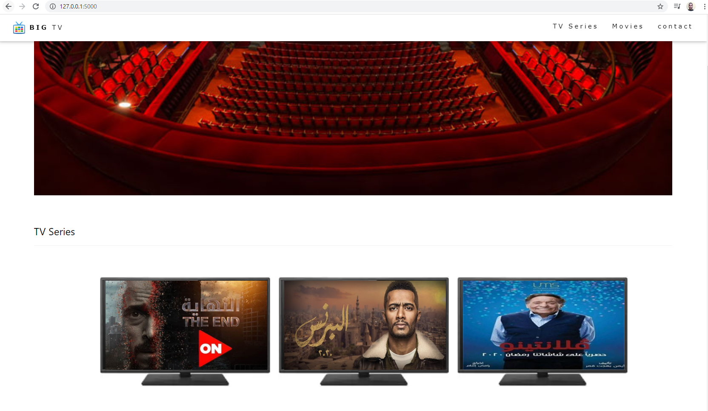
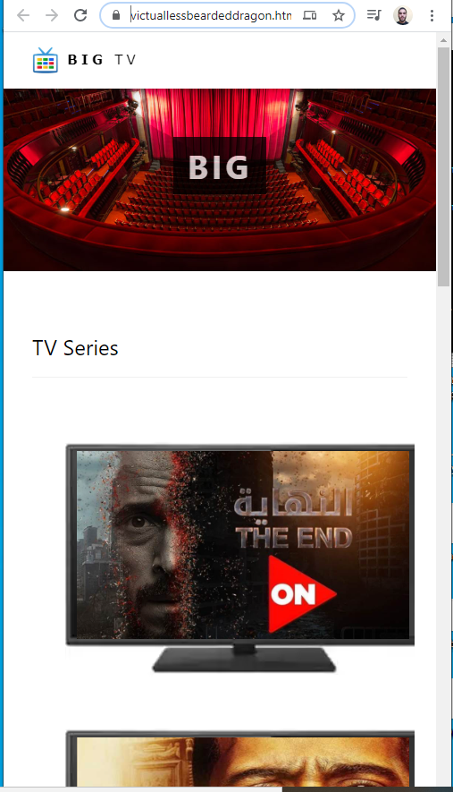

## big_tv (Flask Full responsive W3.css restfull web app)

full responsive template using w3.css,css, flexbox, and media query (movies and tv series website) 

## what is this:
This is a RESTfull web app for movies and tv series and has JSON end Points API to comunicate with it.
It takes from me 2 days to finish this.

What I finished until now?
1.  Create relational database
2.  Create lotsofitems.py file to add moves and tv series to database
3.  Create __init__.py (Flask app or server)
4.  Create repsonsive index with w3.css , flexbox , media query and more then add jinga2 to it
5.  tested and fixed the error prevent from start
6.  lunched the database_setup.py then the lotsofitems.py then last step run the __init__.py
7.  Checked it then edit the errors in the style rerun it again then added to githup

Check It :https://victuallessbeardeddragon.htmlpasta.com/

Developed By Python and JavaScript King: Mahmoud Hegazi
